---
## Front matter
title: "Отчёт по лабораторной работе №2"
subtitle: "Дисциплина: архитектура компьютеров и операционные системы"
author: "Постнова Елизавета Андреевна"

## Generic otions
lang: ru-RU
toc-title: "Содержание"

## Bibliography
bibliography: bib/cite.bib
csl: pandoc/csl/gost-r-7-0-5-2008-numeric.csl

## Pdf output format
toc: true # Table of contents
toc-depth: 2
lof: true # List of figures
lot: true # List of tables
fontsize: 12pt
linestretch: 1.5
papersize: a4
documentclass: scrreprt
## I18n polyglossia
polyglossia-lang:
  name: russian
  options:
	- spelling=modern
	- babelshorthands=true
polyglossia-otherlangs:
  name: english
## I18n babel
babel-lang: russian
babel-otherlangs: english
## Fonts
mainfont: PT Serif
romanfont: PT Serif
sansfont: PT Sans
monofont: PT Mono
mainfontoptions: Ligatures=TeX
romanfontoptions: Ligatures=TeX
sansfontoptions: Ligatures=TeX,Scale=MatchLowercase
monofontoptions: Scale=MatchLowercase,Scale=0.9
## Biblatex
biblatex: true
biblio-style: "gost-numeric"
biblatexoptions:
  - parentracker=true
  - backend=biber
  - hyperref=auto
  - language=auto
  - autolang=other*
  - citestyle=gost-numeric
## Pandoc-crossref LaTeX customization
figureTitle: "Рис."
tableTitle: "Таблица"
listingTitle: "Листинг"
lofTitle: "Список иллюстраций"
lotTitle: "Список таблиц"
lolTitle: "Листинги"
## Misc options
indent: true
header-includes:
  - \usepackage{indentfirst}
  - \usepackage{float} # keep figures where there are in the text
  - \floatplacement{figure}{H} # keep figures where there are in the text
---

# Цель работы

Целью работы является изучить идеологию и применение средств контроля
версий, приобрести практические навыки по работе с системой git.

# Задание

1. Настройка github.
2. Базовая настройка github.
3. Создание SSH ключа.
4. Сознание рабочего пространства и репозитория курса на основе шаблона.
5. Сознание репозитория курса на основе шаблона.
6. Настройка каталога курса.
7. Задания для самостоятельной работы.

# Теоретическое введение

Системы контроля версий (Version Control System, VCS) применяются при
работе нескольких человек над одним проектом. Обычно основное дерево
проекта хранится в локальном или удалённом репозитории, к которому
настроен доступ для участников проекта. При внесении изменений в
содержание проекта система контроля версий позволяет их фиксировать,
совмещать изменения, произведённые разными участниками проекта,
производить откат к любой более ранней версии проекта, если это требуется.
Системы контроля версий поддерживают возможность отслеживания и
разрешения конфликтов, которые могут возникнуть при работе нескольких
человек над одним файлом. Можно объединить (слить) изменения, сделанные
разными участниками (автоматически или вручную), вручную выбрать
нужную версию, отменить изменения вовсе или заблокировать файлы для
изменения. В зависимости от настроек блокировка не позволяет другим
пользователям получить рабочую копию или препятствует изменению
рабочей копии файла средствами файловой системы ОС, обеспечивая таким
образом, привилегированный доступ только одному пользователю,
работающему с файлом. Системы контроля версий также могут обеспечивать
дополнительные, более гибкие функциональные возможности. Например,
они могут поддерживать работу с несколькими версиями одного файла,
сохраняя общую историю изменений до точки ветвления версий и
собственные истории изменений каждой ветви. Кроме того, обычно доступна
информация о том, кто из участников, когда и какие изменения вносил.
Обычно такого рода информация хранится в журнале изменений, доступ к
которому можно ограничить.
Система контроля версий Git представляет собой набор программ командной
строки. Доступ к ним можно получить из терминала посредством ввода
команды git с различными опциями. Благодаря тому, что Git является
распределённой системой контроля версий, резервную копию локального
хранилища можно сделать простым копированием или архивацией.

В табл. @tbl:std-dir приведены основные команды git.

: Основные команды git {#tbl:std-dir}

| Команда | Описание                                                                                                          |
|--------------|----------------------------------------------------------------------------------------------------------------------------|
| `git init`          | создание основного дерева репозитория                                                                               |
| `git pull`      | получение обновлений (изменений) текущего дерева из центрального
репозитория     |
| `git push`       | отправка всех произведённых изменений локального дерева в
центральный репозиторий                                           |
| `git status`      | просмотр списка изменённых файлов в текущей директории |
| `git diff`     | просмотр текущих изменений                                                                                   |
| `git add .`      | добавить все изменённые и/или созданные файлы и/или каталоги                                                                                   |
| `git add
имена_файлов`       | добавить конкретные изменённые и/или созданные файлы и/или
каталоги                                                                              |
| `git rm
имена_файлов`       | удалить файл и/или каталог из индекса репозитория (при этом файл
и/или каталог остаётся в локальной директории)                                                                                 |
| `git commit -am
'Описание
коммита'`      | сохранить все добавленные изменения и все изменённые файлы    |
| `git checkout -b
имя_ветки`      | создание новой ветки, базирующейся на текущей     |
| `git checkout
имя_ветки`      | переключение на некоторую ветку (при переключении на ветку,
которой ещё нет в локальном репозитории, она будет создана и
связана с удалённой)    |
| `git push origin
имя_ветки`      | потправка изменений конкретной ветки в центральный репозиторий     |
| `git merge
--no-ff
имя_ветки`      | слияние ветки с текущим деревом    |
| `git branch -d
имя_ветки`      | удаление локальной уже слитой с основным деревом ветки     |
| `git branch -D
имя_ветки`      | принудительное удаление локальной ветки     |
| `git push origin
:имя_ветки`      | удаление ветки с центрального репозитория     |

Работа пользователя со своей веткой начинается с проверки и получения
изменений из центрального репозитория (при этом в локальное дерево до
начала этой процедуры не должно было вноситься изменений):
git checkout master
git pull
git checkout -b имя_ветки
Затем можно вносить изменения в локальном дереве и/или ветке. После
завершения внесения какого-то изменения в файлы и/или каталоги проекта
необходимо разместить их в центральном репозитории. Для этого необходимо
проверить, какие файлы изменились к текущему моменту:
git status
и при необходимости удаляем лишние файлы, которые не хотим отправлять в
центральный репозиторий.
Затем полезно просмотреть текст изменений на предмет соответствия
правилам ведения чистых коммитов:
git diff
Если какие-либо файлы не должны попасть в коммит, то помечаем только те
файлы, изменения которых нужно сохранить. Для этого используем команды
добавления и/или удаления с нужными опциями:
git add имена_файлов
git rm имена_файлов
Если нужно сохранить все изменения в текущем каталоге, то используем:
git add
Затем сохраняем изменения, поясняя, что было сделано:
git commit -am "Some commit message"
и отправляем в центральный репозиторий:
git push origin имя_ветки
или
git push

# Выполнение лабораторной работы

## **Настройка github**

Создаю учётную запись на сайте github и заполняю основные данные. (рис. @fig:001).

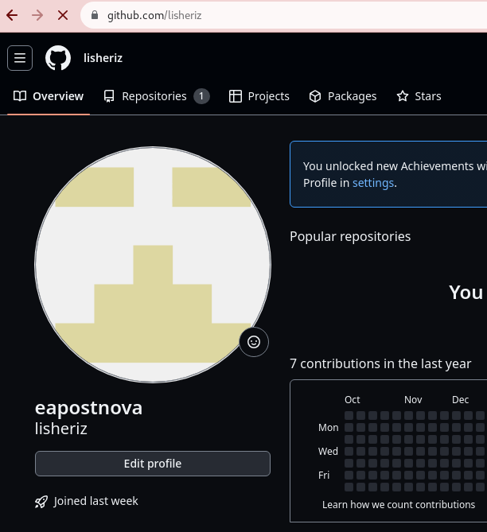{#fig:001 width=70%}

## **Базовая настройка git**

Делаю предварительную конфигурацию git. Открываю терминал и ввожу
следующие команды, указав свои имя и email на github. (рис. @fig:001).

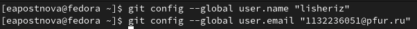{#fig:001 width=70%}

Настраиваю utf-8 в выводе сообщений git. (рис. @fig:001).

{#fig:001 width=70%}

Задаю имя начальной ветки. (рис. @fig:001).

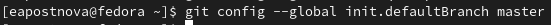{#fig:001 width=70%}

Задаю параметры autocrlf и safecrlf. (рис. @fig:001).

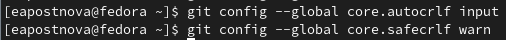{#fig:001 width=70%}

## **Создание SSH ключа**

Для последующей идентификации пользователя на сервере репозиториев сгенерирую пару ключей (приватный и открытый). (рис. @fig:001).

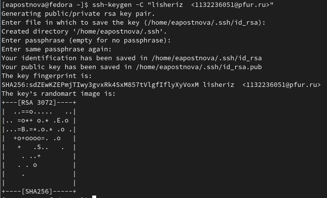{#fig:001 width=70%}

Далее загружаю сгенерированный открытый ключ. Для этого захожу на сайт
github под своей учётной записью и перехожу в меню Setting. После этого
выбираю в боковом меню SSH and GPG keys и нажимаю кнопку New SSH
key. Скопировав из локальной консоли ключ в буфер обмена с помощью
команды, (рис. @fig:001).

{#fig:001 width=70%}

вставляю ключ в появившееся на сайте поле и указываю для ключа имя. (рис. @fig:001).

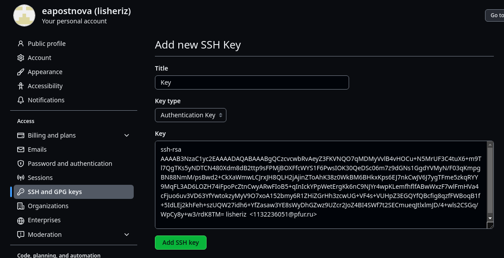{#fig:001 width=70%}

## **Создание рабочего пространства и репозитория курса на основе шаблона**

Открываю терминал и создаю каталог для предмета «Архитектура
компьютера». (рис. @fig:001).

{#fig:001 width=70%}

(рис. @fig:001).

{#fig:001 width=70%}

## **Создание репозитория курса на основе шаблона**

Перехожу на станицу репозитория с шаблоном курса и выбираю Use this
template. В открывшемся окне задаю имя репозитория - study_2023–
2024_arhpc и создаю репозиторий. (рис. @fig:001).

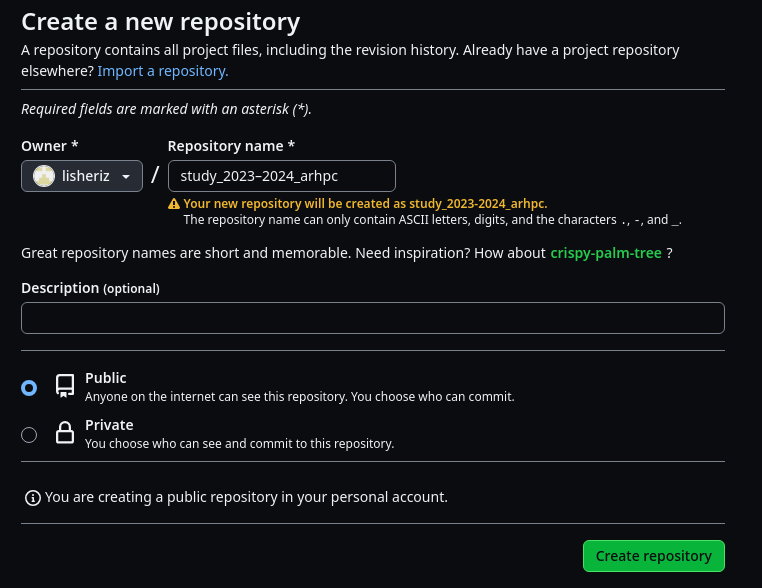{#fig:001 width=70%}

Открываю терминал, перехожу в каталог курса и клонирую созданный
репозиторий. (рис. @fig:001).

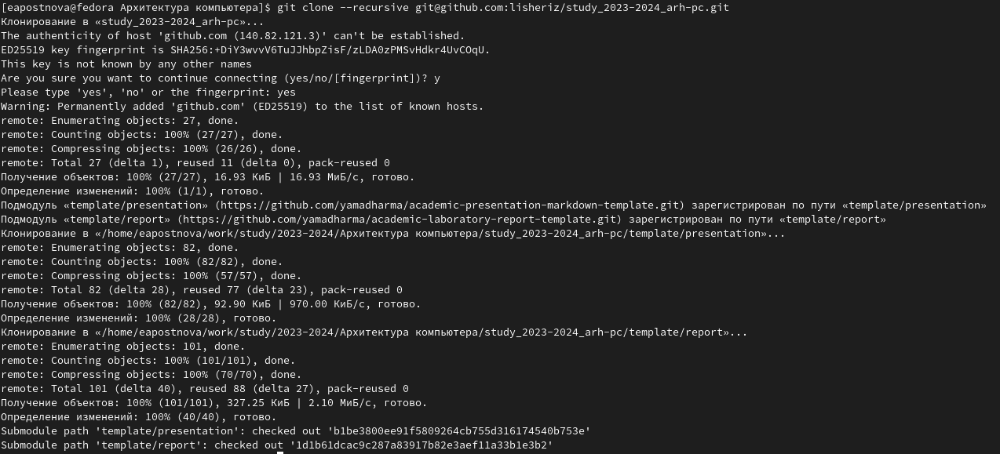{#fig:001 width=70%}

## **Настройка каталога курса**

Перехожу в каталог курса, удаляю лишние файлы и создаю необходимые
каталоги. (рис. @fig:001).

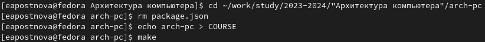{#fig:001 width=70%}

Отправляю файлы на сервер.(рис. @fig:001).

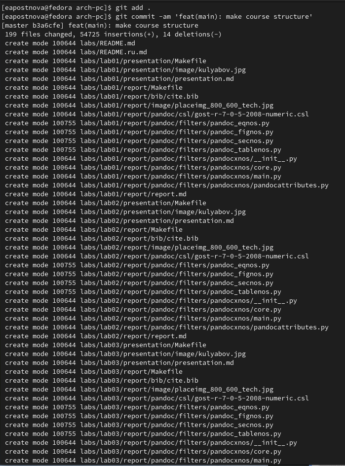{#fig:001 width=70%}

(рис. @fig:001).

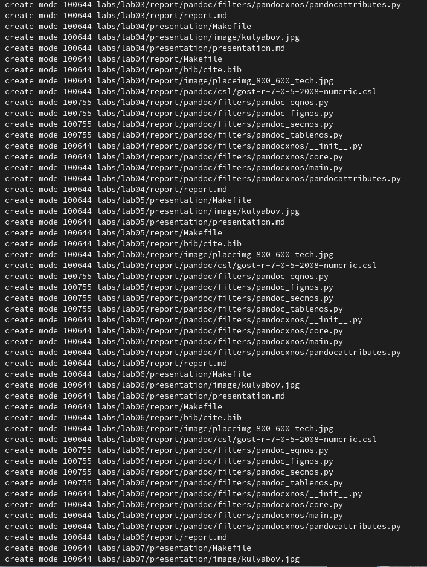{#fig:001 width=70%}

(рис. @fig:001).

{#fig:001 width=70%}

(рис. @fig:001).

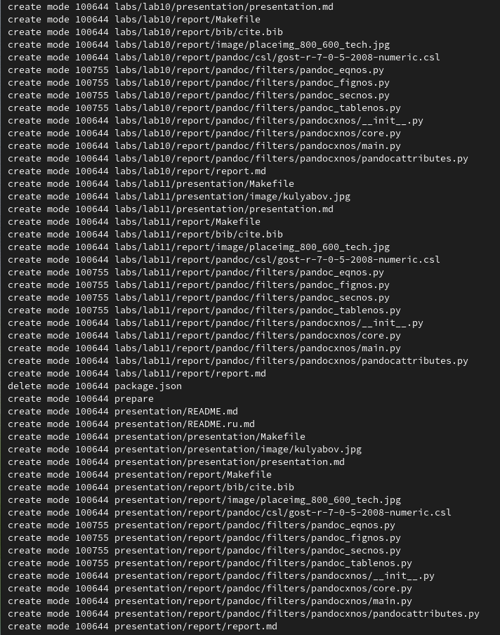{#fig:001 width=70%}

(рис. @fig:001).

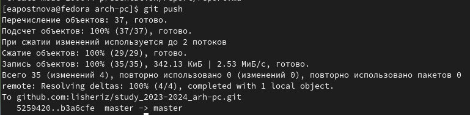{#fig:001 width=70%}

Проверяю правильность создания иерархии рабочего пространства в
локальном репозитории и на странице github. (рис. @fig:001).

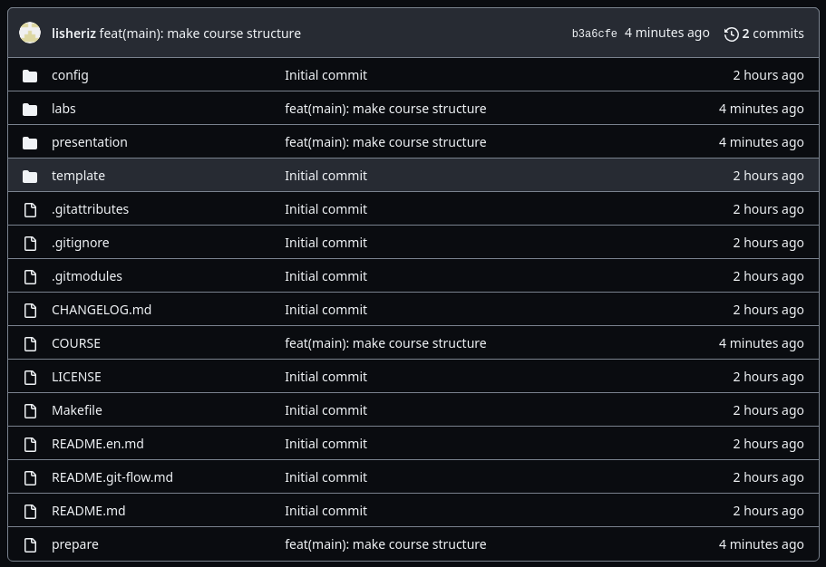{#fig:001 width=70%}

(рис. @fig:001).

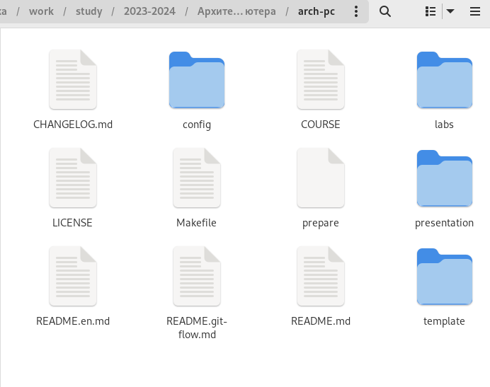{#fig:001 width=70%}

## **Задания для самостоятельной работы**

1. Создаю отчет по выполнению лабораторной работы в соответствующем
каталоге рабочего пространства (labs/lab02/report). (рис. @fig:001).

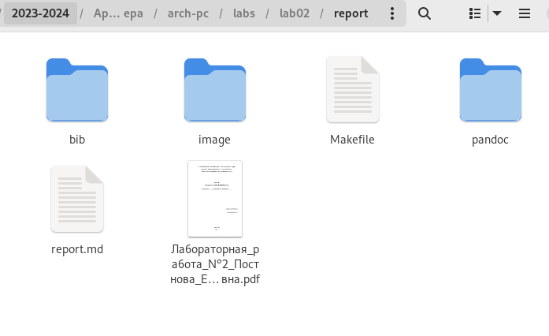{#fig:001 width=70%}

2. Копирую отчет по выполнению предыдущей лабораторной работы в
соответствующий каталог созданного рабочего пространства. (рис. @fig:001).

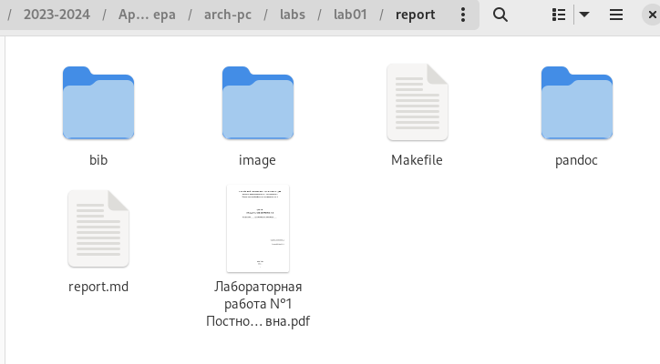{#fig:001 width=70%}

3. Загружаю файлы на github. (рис. @fig:001).

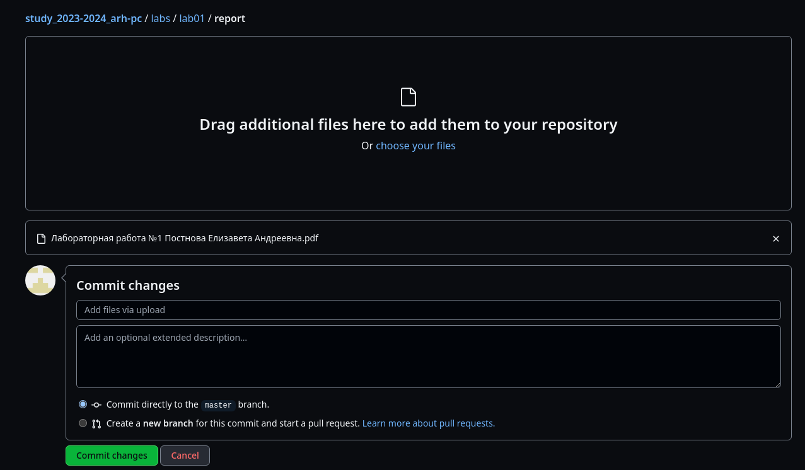{#fig:001 width=70%}

(рис. @fig:001).

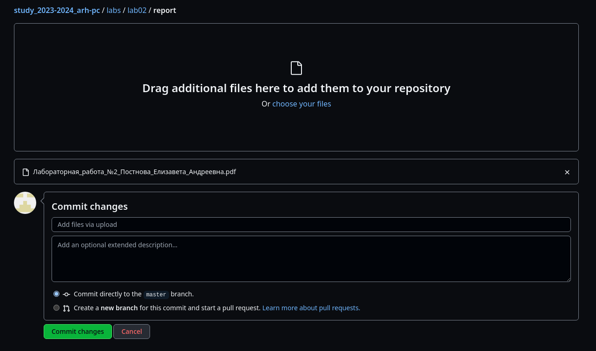{#fig:001 width=70%}

# Выводы

По результатам данной лабораторной работы я приобрела практические
навыки по работе с системой git, изучила идеологию и применение средств
контроля версий. Эти навыки помогут мне в дальнейшем в работе с данной
системой.

# Список литературы

1. GDB: The GNU Project Debugger. — URL: https://www.gnu.org/software/gdb/.
2. GNU Bash Manual. — 2016. — URL: https://www.gnu.org/software/bash/manual/.
3. Midnight Commander Development Center. — 2021. — URL: https://midnight-commander.
org/.
4. NASM Assembly Language Tutorials. — 2021. — URL: https://asmtutor.com/.
5. Newham C. Learning the bash Shell: Unix Shell Programming. — O’Reilly Media, 2005. —
354 с. — (In a Nutshell). — ISBN 0596009658. — URL:
http://www.amazon.com/Learningbash-Shell-Programming-Nutshell/dp/0596009658.
6. Robbins A. Bash Pocket Reference. — O’Reilly Media, 2016. — 156 с. — ISBN 978-1491941591.
7. The NASM documentation. — 2021. — URL: https://www.nasm.us/docs.php.
8. Zarrelli G. Mastering Bash. — Packt Publishing, 2017. — 502 с. — ISBN 9781784396879.
9. Колдаев В. Д., Лупин С. А. Архитектура ЭВМ. — М. : Форум, 2018.
10. Куляс О. Л., Никитин К. А. Курс программирования на ASSEMBLER. — М. : Солон-
Пресс, 2017.
11. Новожилов О. П. Архитектура ЭВМ и систем. — М. : Юрайт, 2016.
12. Расширенный ассемблер: NASM. — 2021. — URL:
https://www.opennet.ru/docs/RUS/nasm/.
13. Робачевский А., Немнюгин С., Стесик О. Операционная система UNIX. — 2-е изд. —
БХВПетербург, 2010. — 656 с. — ISBN 978-5-94157-538-1.
14. Столяров А. Программирование на языке ассемблера NASM для ОС Unix. — 2-е изд.
— М. : МАКС Пресс, 2011. — URL: http://www.stolyarov.info/books/asm_unix.
15. Таненбаум Э. Архитектура компьютера. — 6-е изд. — СПб. : Питер, 2013. — 874 с. —
(Классика Computer Science).
16. Таненбаум Э., Бос Х. Современные операционные системы. — 4-е изд. — СПб. :
Питер, 2015. — 1120 с. — (Классика Computer Science).
