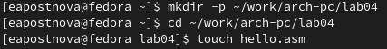
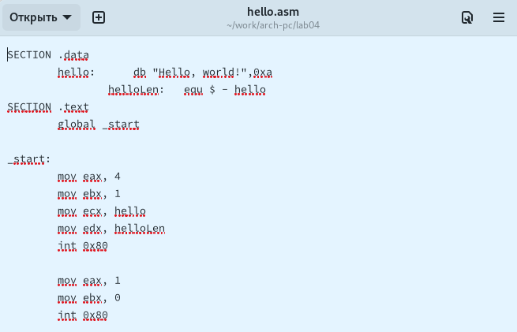
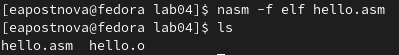
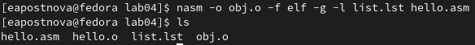
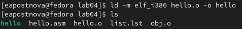
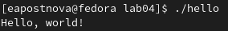
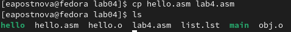
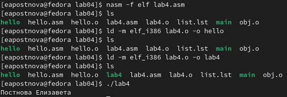
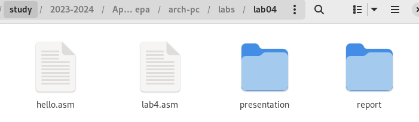
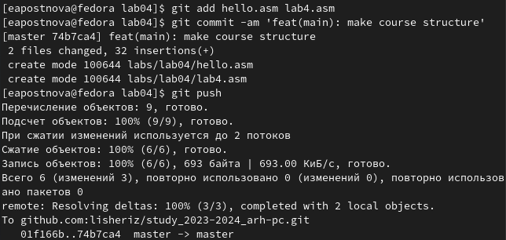

---
## Front matter
title: "Отчёт по лабораторной работе №4"
subtitle: "Дисциплина: архитектура компьютеров и операционные системы"
author: "Постнова Елизавета Андреевна"

## Generic otions
lang: ru-RU
toc-title: "Содержание"

## Bibliography
bibliography: bib/cite.bib
csl: pandoc/csl/gost-r-7-0-5-2008-numeric.csl

## Pdf output format
toc: true # Table of contents
toc-depth: 2
lof: true # List of figures
lot: true # List of tables
fontsize: 12pt
linestretch: 1.5
papersize: a4
documentclass: scrreprt
## I18n polyglossia
polyglossia-lang:
  name: russian
  options:
	- spelling=modern
	- babelshorthands=true
polyglossia-otherlangs:
  name: english
## I18n babel
babel-lang: russian
babel-otherlangs: english
## Fonts
mainfont: PT Serif
romanfont: PT Serif
sansfont: PT Sans
monofont: PT Mono
mainfontoptions: Ligatures=TeX
romanfontoptions: Ligatures=TeX
sansfontoptions: Ligatures=TeX,Scale=MatchLowercase
monofontoptions: Scale=MatchLowercase,Scale=0.9
## Biblatex
biblatex: true
biblio-style: "gost-numeric"
biblatexoptions:
  - parentracker=true
  - backend=biber
  - hyperref=auto
  - language=auto
  - autolang=other*
  - citestyle=gost-numeric
## Pandoc-crossref LaTeX customization
figureTitle: "Рис."
tableTitle: "Таблица"
listingTitle: "Листинг"
lofTitle: "Список иллюстраций"
lotTitle: "Список таблиц"
lolTitle: "Листинги"
## Misc options
indent: true
header-includes:
  - \usepackage{indentfirst}
  - \usepackage{float} # keep figures where there are in the text
  - \floatplacement{figure}{H} # keep figures where there are in the text
---

# Цель работы

Целью данной лабораторной работы является освоение процедуры компиляции и сборки программ, написанных на ассемблере NASM.

# Задание

1. Программа Hello world!
2. Транслятор NASM
3. Расширенный синтаксис командной строки NASM
4. Компоновщик LD
5. Запуск исполняемого файла
6. Задание для самостоятельной работы

# Теоретическое введение

Для того, чтобы писать программы на ассемблере, необходимо знать, какие регистры
процессора существуют и как их можно использовать. Большинство команд в программах
написанных на ассемблере используют регистры в качестве операндов. Практически все
команды представляют собой преобразование данных хранящихся в регистрах процессора,
это например пересылка данных между регистрами или между регистрами и памятью, преобразование (арифметические или логические операции) данных хранящихся в регистрах. Доступ к регистрам осуществляется не по адресам, как к основной памяти, а по именам.
Каждый регистр процессора архитектуры x86 имеет свое название, состоящее из 2 или 3
букв латинского алфавита.
В качестве примера приведем названия основных регистров общего назначения (именно
эти регистры чаще всего используются при написании программ):
• RAX, RCX, RDX, RBX, RSI, RDI — 64-битные
• EAX, ECX, EDX, EBX, ESI, EDI — 32-битные
• AX, CX, DX, BX, SI, DI — 16-битные
• AH, AL, CH, CL, DH, DL, BH, BL — 8-битные (половинки 16-битных регистров). Например,
AH (high AX) — старшие 8 бит регистра AX, AL (low AX) — младшие 8 бит регистра AX.
Язык ассемблера (assembly language, сокращённо asm) — машинно-ориентированный
язык низкого уровня. Можно считать, что он больше любых других языков приближен к
архитектуре ЭВМ и её аппаратным возможностям, что позволяет получить к ним более
полный доступ, нежели в языках высокого уровня,таких как C/C++, Perl, Python и пр. Заметим,
что получить полный доступ к ресурсам компьютера в современных архитектурах нельзя,
самым низким уровнем работы прикладной программы является обращение напрямую к
ядру операционной системы. Именно на этом уровне и работают программы, написанные
на ассемблере. Но в отличие от языков высокого уровня ассемблерная программа содержит
только тот код, который ввёл программист. Таким образом язык ассемблера — это язык, с
помощью которого понятным для человека образом пишутся команды для процессора.
Следует отметить, что процессор понимает не команды ассемблера, а последовательности
из нулей и единиц — машинные коды. До появления языков ассемблера программистам
приходилось писать программы, используя только лишь машинные коды, которые были
крайне сложны для запоминания, так как представляли собой числа, записанные в двоичной
или шестнадцатеричной системе счисления. Преобразование или трансляция команд с языка ассемблера в исполняемый машинный код осуществляется специальной программой
транслятором — Ассемблер.
NASM — это открытый проект ассемблера, версии которого доступны под различные
операционные системы и который позволяет получать объектные файлы для этих систем. В
NASM используется Intel-синтаксис и поддерживаются инструкции x86-64.
Программа на языке ассемблера также может содержать директивы — инструкции, не переводящиеся непосредственно в машинные команды, а управляющие работой транслятора.
Например, директивы используются для определения данных (констант и переменных) и
обычно пишутся большими буквами.

# Выполнение лабораторной работы

## **Программа Hello world!**

Создаю каталог для работы с программами на языке ассемблера NASM и перехожу в созданный каталог. (рис. @fig:001)

{#fig:001 width=70%}

Создаю текстовый файл с именем hello.asm, открываю этот файл с помощью текстового редактора и ввожу следующий текст. (рис. @fig:001)

{#fig:001 width=70%}

## **Транслятор NASM**

Компилируем приведённый выше текст программы при помощи команды nasm -f elf hello.asm «Hello World» и проверим, что файл создан. (рис. @fig:001)

{#fig:001 width=70%}

## **Расширенный синтаксис командной строки NASM**

С помощью команды nasm -o obj.o -f elf -g -l list.lst hello.asm скомпилируем исходный файл hello.asm в obj.o и проверим, что файл создан. (рис. @fig:001)

{#fig:001 width=70%}

## **Компоновщик LD**

Передаем объектный файл на обработку компоновщику с помощью команды ld -m elf_i386 hello.o -o hello и проверяем, что исполняемый файл hello был создан. (рис. @fig:001)

{#fig:001 width=70%}

Создадим еще один файл с помощью команды ld -m elf_i386 obj.o -o main. (рис. @fig:001)

{#fig:001 width=70%}

Имя исполняемого файа - main, имя объектного файла - obj.o

## **Запуск исполняемого файла**

Запустим созданный исполняемый файл с помощью команды ./hello. (рис. @fig:001)

{#fig:001 width=70%}

## **Задание для самостоятельной работы**

1. В каталоге ~/work/arch-pc/lab04 с помощью команды cp создаю копию файла
hello.asm с именем lab4.asm. (рис. @fig:001)

{#fig:001 width=70%}

2. С помощью текстового редактора вношу изменения в текст программы в
файле lab4.asm так, чтобы вместо Hello world! на экран выводилась строка с моими
фамилией и именем. (рис. @fig:001)

{#fig:001 width=70%}

3. Компилирую полученный текст программы lab4.asm в объектный файл. Выполняю
компоновку объектного файла и запускаю получившийся исполняемый файл. (рис. @fig:001)

{#fig:001 width=70%}

4. Копирую файлы hello.asm и lab4.asm в локальный репозиторий в каталог ~/work/study/2023-2024/"Архитектура компьютера"/arch-pc/labs/lab04/. (рис. @fig:001)

{#fig:001 width=70%}

Загружаю файлы на Github. (рис. @fig:001)

{#fig:001 width=70%}

# Выводы

С помощью данной лабораторной работы я освоила процедуры компиляции и сборки программ, написанных на ассемблере NASM.

# Список литературы

1. GDB: The GNU Project Debugger. — URL: https://www.gnu.org/software/gdb/.
2. GNU Bash Manual. — 2016. — URL: https://www.gnu.org/software/bash/manual/.
3. Midnight Commander Development Center. — 2021. — URL: https://midnight-commander.
org/.
4. NASM Assembly Language Tutorials. — 2021. — URL: https://asmtutor.com/.
5. Newham C. Learning the bash Shell: Unix Shell Programming. — O’Reilly Media, 2005. —
354 с. — (In a Nutshell). — ISBN 0596009658. — URL: http://www.amazon.com/Learningbash-Shell-Programming-Nutshell/dp/0596009658.
6. Robbins A. Bash Pocket Reference. — O’Reilly Media, 2016. — 156 с. — ISBN 978-1491941591.
7. The NASM documentation. — 2021. — URL: https://www.nasm.us/docs.php.
8. Zarrelli G. Mastering Bash. — Packt Publishing, 2017. — 502 с. — ISBN 9781784396879.
9. Колдаев В. Д., Лупин С. А. Архитектура ЭВМ. — М. : Форум, 2018.
10. Куляс О. Л., Никитин К. А. Курс программирования на ASSEMBLER. — М. : Солон-Пресс, 2017.
11. Новожилов О. П. Архитектура ЭВМ и систем. — М. : Юрайт, 2016.
12. Расширенный ассемблер: NASM. — 2021. — URL: https://www.opennet.ru/docs/RUS/nasm/.
13. Робачевский А., Немнюгин С., Стесик О. Операционная система UNIX. — 2-е изд. — БХВПетербург, 2010. — 656 с. — ISBN 978-5-94157-538-1.
14. Столяров А. Программирование на языке ассемблера NASM для ОС Unix. — 2-е изд. —
М. : МАКС Пресс, 2011. — URL: http://www.stolyarov.info/books/asm_unix.
15. Таненбаум Э. Архитектура компьютера. — 6-е изд. — СПб. : Питер, 2013. — 874 с. —
(Классика Computer Science).
16. Таненбаум Э., Бос Х. Современные операционные системы. — 4-е изд. — СПб. : Питер 2015. — 1120 с. — (Классика Computer Science).
