---
## Front matter
title: "Отчёт по лабораторной работе №5"
subtitle: "Дисциплина: архитектура компьютеров и операционные системы"
author: "Постнова Елизавета Андреевна"

## Generic otions
lang: ru-RU
toc-title: "Содержание"

## Bibliography
bibliography: bib/cite.bib
csl: pandoc/csl/gost-r-7-0-5-2008-numeric.csl

## Pdf output format
toc: true # Table of contents
toc-depth: 2
lof: true # List of figures
lot: true # List of tables
fontsize: 12pt
linestretch: 1.5
papersize: a4
documentclass: scrreprt
## I18n polyglossia
polyglossia-lang:
  name: russian
  options:
	- spelling=modern
	- babelshorthands=true
polyglossia-otherlangs:
  name: english
## I18n babel
babel-lang: russian
babel-otherlangs: english
## Fonts
mainfont: PT Serif
romanfont: PT Serif
sansfont: PT Sans
monofont: PT Mono
mainfontoptions: Ligatures=TeX
romanfontoptions: Ligatures=TeX
sansfontoptions: Ligatures=TeX,Scale=MatchLowercase
monofontoptions: Scale=MatchLowercase,Scale=0.9
## Biblatex
biblatex: true
biblio-style: "gost-numeric"
biblatexoptions:
  - parentracker=true
  - backend=biber
  - hyperref=auto
  - language=auto
  - autolang=other*
  - citestyle=gost-numeric
## Pandoc-crossref LaTeX customization
figureTitle: "Рис."
tableTitle: "Таблица"
listingTitle: "Листинг"
lofTitle: "Список иллюстраций"
lotTitle: "Список таблиц"
lolTitle: "Листинги"
## Misc options
indent: true
header-includes:
  - \usepackage{indentfirst}
  - \usepackage{float} # keep figures where there are in the text
  - \floatplacement{figure}{H} # keep figures where there are in the text
---

# Цель работы

Приобретение практических навыков работы в Midnight Commander. Освоение инструкций
языка ассемблера mov и int.

# Задание

1. Начало работы с  Midnight Commander.
2. Подключение внешнего файла in_out.asm.
3. Задания для самостоятельной работы.

# Теоретическое введение

Midnight Commander (или просто mc) — это программа, которая позволяет просматривать
структуру каталогов и выполнять основные операции по управлению файловой системой,
т.е. mc является файловым менеджером. Для активации оболочки Midnight Commander достаточно ввести в командной строке mc и
нажать клавишу Enter.

В табл. @tbl:std-dir приведено краткое описание функциональных клавиш F1 — F10 , к которым привязаны часто выполняемые операции в Midnight Commander.

: Функциональные клавиши F1 — F10 {#tbl:std-dir}

| Функциональные клавиши | Выполняемое действие                                                                                                         |
|--------------|----------------------------------------------------------------------------------------------------------------------------|
| `F1`          | вызов контекстно-зависимой подсказки                                                                               |
| `F2`      | вызов меню, созданного пользователем     |
| `F3`       | просмотр файла, на который указывает подсветка в активной панели                                          |
| `F4`      | вызов встроенного редактора для файла, на который указывает подсветка в активной панели |
| `F5`     | копирование файла или группы отмеченных файлов из каталога, отображаемого в активной панели, в каталог, отображаемый на второй
панели                                 |
| `F6`      | перенос файла или группы отмеченных файлов из каталога, отображаемого
в активной панели, в каталог, отображаемый на второй панели                                 |
| `F7`       | создание подкаталога в каталоге, отображаемом в активной панели                                                                                                  |
| `F8`       | удаление файла (подкаталога) или группы отмеченных файлов                                                                              |
| `F9`       | вызов основного меню программы                                                                             |
| `F10`       | выход из программы                                                                            |

Программа на языке ассемблера NASM, как правило, состоит из трёх секций: секция кода
программы (SECTION .text), секция инициированных (известных во время компиляции)
данных (SECTION .data) и секция неинициализированных данных (тех, под которые во
время компиляции только отводится память, а значение присваивается в ходе выполнения
программы) (SECTION .bss).

Для объявления инициированных данных в секции .data используются директивы DB, DW,
DD, DQ и DT, которые резервируют память и указывают, какие значения должны храниться в этой памяти.
Директивы используются для объявления простых переменных и для объявления массивов. Для определения строк принято использовать директиву DB в связи с особенностями
хранения данных в оперативной памяти.
Инструкция языка ассемблера mov предназначена для дублирования данных источника в
приёмнике. 
Инструкция языка ассемблера int предназначена для вызова прерывания с указанным
номером. После вызова инструкции int 80h выполняется системный вызов какой-либо функции ядра Linux. При этом происходит передача управления ядру операционной системы. Чтобы
узнать, какую именно системную функцию нужно выполнить, ядро извлекает номер системного вызова из регистра eax. Поэтому перед вызовом прерывания необходимо поместить в этот регистр нужный номер. Кроме того, многим системным функциям требуется передавать какие-либо параметры. По принятым в ОС Linux правилам эти параметры помещаются в порядке следования в остальные регистры процессора: ebx, ecx, edx. Если системная функция должна вернуть значение, то она помещает его в регистр eax. Простейший диалог с пользователем требует наличия двух функций — вывода текста на
экран и ввода текста с клавиатуры. Простейший способ вывести строку на экран — использовать системный вызов write. Этот системный вызов имеет номер 4, поэтому перед вызовом
инструкции int необходимо поместить значение 4 в регистр eax. Первым аргументом write,
помещаемым в регистр ebx, задаётся дескриптор файла. Для вывода на экран в качестве
дескриптора файла нужно указать 1 (это означает «стандартный вывод», т. е. вывод на экран).
Вторым аргументом задаётся адрес выводимой строки (помещаем его в регистр ecx, например, инструкцией mov ecx, msg). Строка может иметь любую длину. Последним аргументом
(т.е. в регистре edx) должна задаваться максимальная длина выводимой строки.
Для ввода строки с клавиатуры можно использовать аналогичный системный вызов read.
Его аргументы –такие же, как у вызова write,только для «чтения» с клавиатуры используется
файловый дескриптор 0 (стандартный ввод).
Системный вызов exit является обязательным в конце любой программы на языке ассемблер. Для обозначения конца программы перед вызовом инструкции int 80h необходимо
поместить в регистр еах значение 1, а в регистр ebx код завершения 0.

# Выполнение лабораторной работы

## **Начало работы с  Midnight Commander**

Открываю Midnight Commander. (рис. @fig:001).

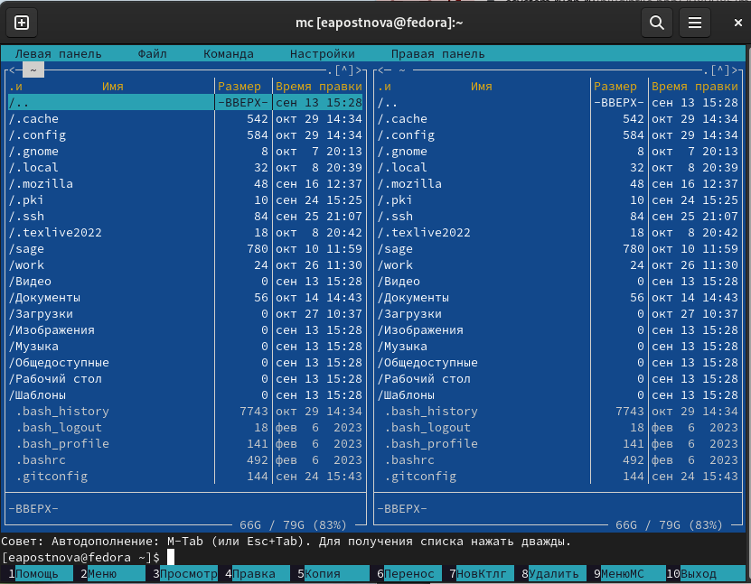{#fig:001 width=70%}

Пользуясь клавишами вверх, вниз и Enter перехожу в каталог ~/work/arch-pc, созданный
при выполнении лабораторной работы №4, с помощью функциональной клавиши F7 создаю папку lab05 и перехожу в созданный каталог. (рис. @fig:001).

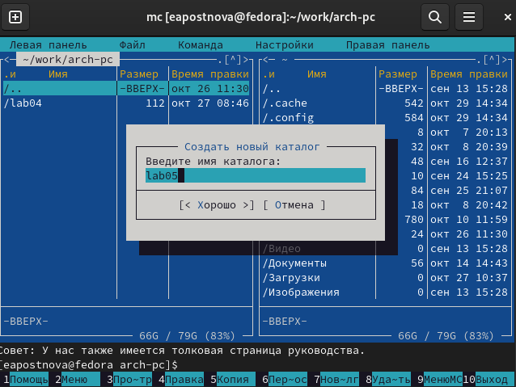{#fig:001 width=70%}

Пользуясь строкой ввода и командой touch создаю файл lab5-1.asm. (рис. @fig:001).

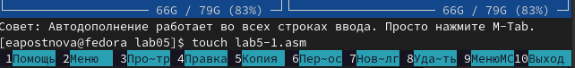{#fig:001 width=70%}

С помощью функциональной клавиши F4 открываю файл lab5-1.asm для редактирования во встроенном редакторе, ввожу текст программы из листинга 5.1, сохраняю изменения с помощью функциональной клавиши F2 и закрываю файл. (рис. @fig:001).

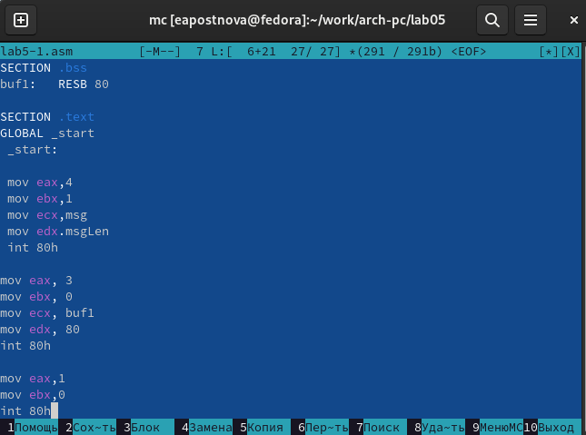{#fig:001 width=70%}

С помощью функциональной клавиши F3 открываю файл lab5-1.asm для просмотра и убеждаюсь, что файл содержит текст программы. (рис. @fig:001).

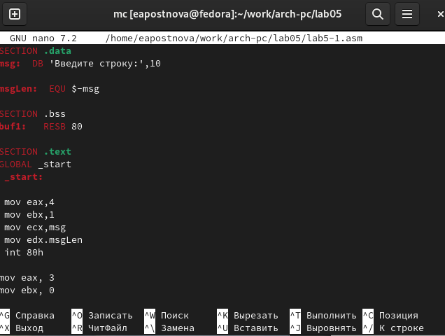{#fig:001 width=70%}

Компилирую текст программы lab5-1.asm в объектный файл, выполняю компоновку объектного файла и запускаю получившийся исполняемый файл, в строку ввожу свои ФИО. (рис. @fig:001).

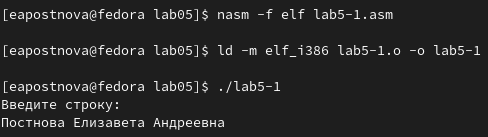{#fig:001 width=70%}  

## **Подключение внешнего файла in_out.asm**

Скачиваю файл in_out.asm со страницы курса в ТУИС.
В первой панели mc открываю каталог с файлом lab5-1.asm, а во второй панели каталог
со скачанным файлом in_out.asm. 
Копирую файл in_out.asm в каталог с файлом lab5-1.asm с помощью функциональной
клавиши F5. (рис. @fig:001).

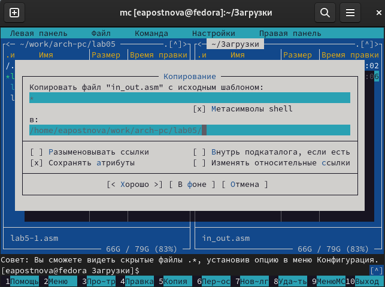{#fig:001 width=70%} 

С помощью функциональной клавиши F6 создаю копию файла lab5-1.asm с именем
lab5-2.asm. (рис. @fig:001).

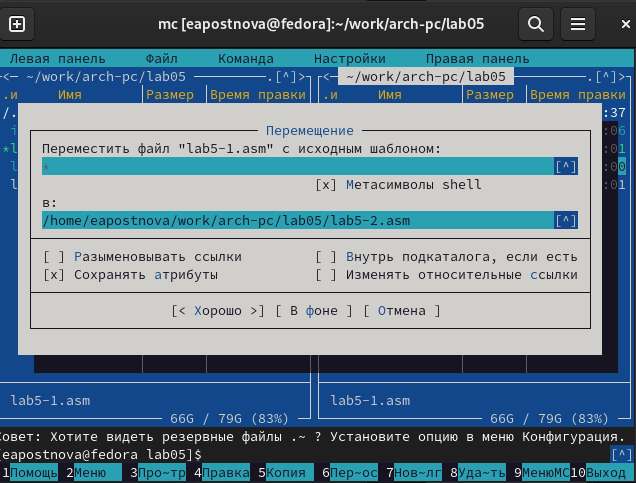{#fig:001 width=70%}

Исправляю текст программы в файле lab5-2.asm с использование подпрограмм из
внешнего файла in_out.asm в соответствии с листингом 5.2. (рис. @fig:001).

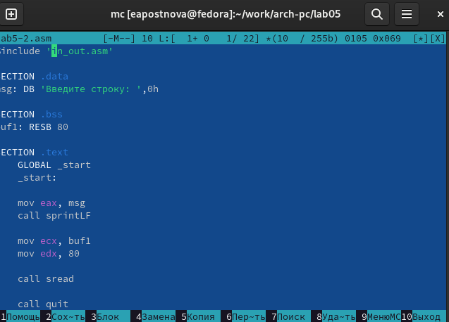{#fig:001 width=70%}

Создаю исполняемый файл и проверяю его работу. (рис. @fig:001).

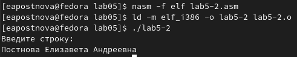{#fig:001 width=70%}

Затем в файле lab5-2.asm заменяю подпрограмму sprintLF на sprint. (рис. @fig:001).

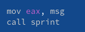{#fig:001 width=70%}

Создаю исполняемый файл и проверяю его работу. (рис. @fig:001).

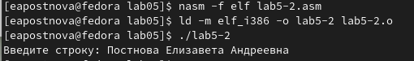{#fig:001 width=70%}

**Разница состоит в том, что в изначальной программе ввод текста происходил с новой строки, в измененной же программе перехода на новую строку нет.**

## **Задания для самостоятельной работы**

1. Создаю копию файла lab5-1.asm. (рис. @fig:001).

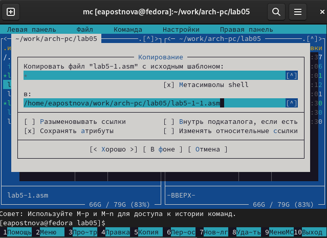{#fig:001 width=70%}

Вношу изменения в программу так, чтобы она выводила введённую строку на экран. (рис. @fig:001).

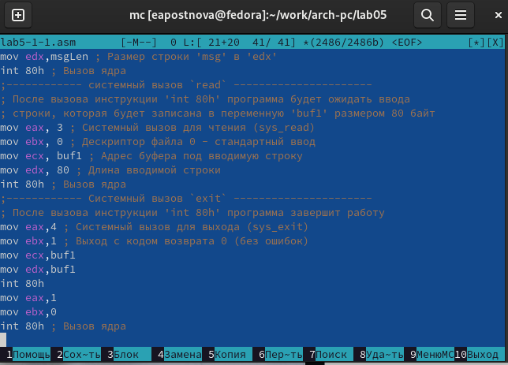{#fig:001 width=70%}

Сам код:

SECTION .data

msg: DB 'Введите строку:',10 

msgLen: EQU $-msg 

SECTION .bss 

buf1: RESB 80

SECTION .text 

GLOBAL _start 

_start: 

mov eax,4

mov ebx,1 

mov ecx,msg 

mov edx,msgLen 

int 80h 

mov eax, 3 

mov ebx, 0 

mov ecx, buf1 

mov edx, 80 

int 80h 

mov eax,4 

mov ebx,1 

mov ecx,buf1

mov edx,buf1

int 80h

mov eax,1

mov ebx,0

int 80h 

2. Получаю исполняемый файл и проверяю его работу. На приглашение ввести строку
ввожу свою фамилию. (рис. @fig:001).

{#fig:001 width=70%}

Программа работает.

3. Создаю копию файла lab5-2.asm. (рис. @fig:001).

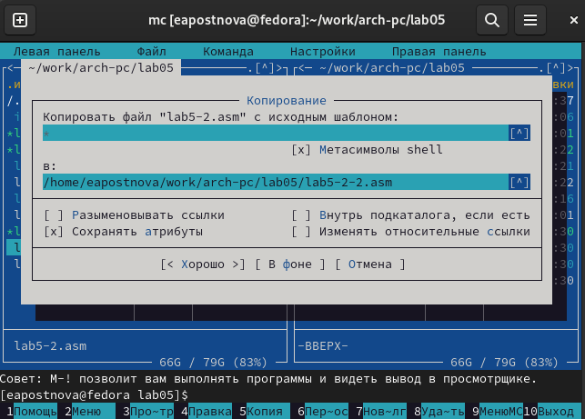{#fig:001 width=70%}

Вношу изменения в программу с использование подпрограмм из внешнего файла in_out.asm так, чтобы она выводила введённую строку на экран. (рис. @fig:001).

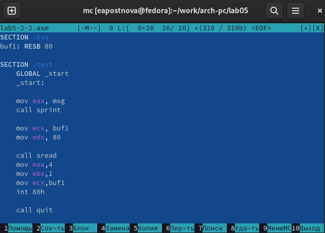{#fig:001 width=70%}

Сам код:

%include 'in_out.asm'

SECTION .data

msg: DB 'Введите строку: ',0h

SECTION .bss

buf1: RESB 80

SECTION .text

    GLOBAL _start
    
    _start:

    mov eax, msg
    
    call sprint

    mov ecx, buf1
    
    mov edx, 80

    call sread
    
    mov eax,4
    
    mov ebx,1
    
    mov ecx,buf1
    
    int 80h

    call quit

4. Создаю исполняемый файл и проверяю его работу. (рис. @fig:001).

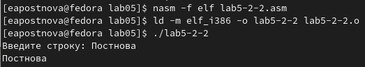{#fig:001 width=70%}

Программа работает.

# Выводы

Благодаря данной лабораторной работе я приобрела навыки работы в Midnight Commander и освоила инструкции языка ассемблер mov и int, что поможет мне при выполнении последующих лабораторных работ.

# Список литературы{.unnumbered}

1. GDB: The GNU Project Debugger. — URL: https://www.gnu.org/software/gdb/.
2. GNU Bash Manual. — 2016. — URL: https://www.gnu.org/software/bash/manual/.
3. Midnight Commander Development Center. — 2021. — URL: https://midnight-commander.
org/.
4. NASM Assembly Language Tutorials. — 2021. — URL: https://asmtutor.com/.
5. Newham C. Learning the bash Shell: Unix Shell Programming. — O’Reilly Media, 2005. —
354 с. — (In a Nutshell). — ISBN 0596009658. — URL: http://www.amazon.com/Learningbash-Shell-Programming-Nutshell/dp/0596009658.
6. Robbins A. Bash Pocket Reference. — O’Reilly Media, 2016. — 156 с. — ISBN 978-1491941591.
7. The NASM documentation. — 2021. — URL: https://www.nasm.us/docs.php.
8. Zarrelli G. Mastering Bash. — Packt Publishing, 2017. — 502 с. — ISBN 9781784396879.
9. Колдаев В. Д., Лупин С. А. Архитектура ЭВМ. — М. : Форум, 2018.
10. Куляс О. Л., Никитин К. А. Курс программирования на ASSEMBLER. — М. : Солон-Пресс, 2017.
11. Новожилов О. П. Архитектура ЭВМ и систем. — М. : Юрайт, 2016.
12. Расширенный ассемблер: NASM. — 2021. — URL: https://www.opennet.ru/docs/RUS/nasm/.
13. Робачевский А., Немнюгин С., Стесик О. Операционная система UNIX. — 2-е изд. — БХВПетербург, 2010. — 656 с. — ISBN 978-5-94157-538-1.
14. Столяров А. Программирование на языке ассемблера NASM для ОС Unix. — 2-е изд. —
М. : МАКС Пресс, 2011. — URL: http://www.stolyarov.info/books/asm_unix.
15. Таненбаум Э. Архитектура компьютера. — 6-е изд. — СПб. : Питер, 2013. — 874 с. —
(Классика Computer Science).
16. Таненбаум Э., Бос Х. Современные операционные системы. — 4-е изд. — СПб. : Питер,2015. — 1120 с. — (Классика Computer Science).
